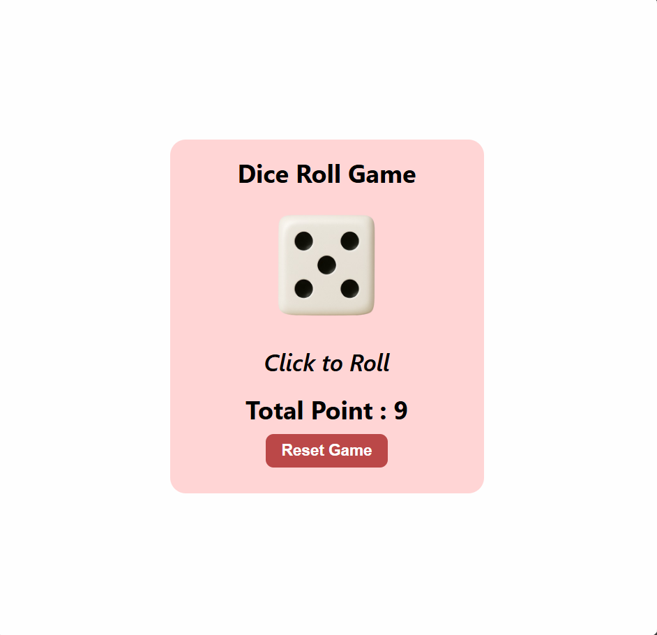

# 🎲 Dice Game

A simple and fun dice rolling game built with React and Vite.

## 📷 Game Preview



## 🎮 Features

- Roll a dice and see the result
- Track your total points
- Interactive UI with visual dice images
- Responsive design

## 🛠️ Technologies Used

- **React** - Frontend library for building the user interface
- **Vite** - Next-generation build tool for fast development
- **JavaScript** - Programming language
- **CSS** - Styling

## 📋 Prerequisites

Before you begin, ensure you have the following installed:

- [Node.js](https://nodejs.org/) (version 18 or higher)
- [npm](https://www.npmjs.com/) or [yarn](https://yarnpkg.com/)

## 🚀 Installation

1. Clone the repository:
```
bash
git clone <your-repository-url>
```

2. Navigate to the project directory:
```
bash
cd dice-game
```

3. Install dependencies:
```
bash
npm install
```

## ▶️ How to Run

Start the development server:
```
bash
npm run dev
```

Build for production:
```
bash
npm run build
```

Preview the production build:
```bash
npm run preview
```


## 📁 Project Structure

```
dice-game/
├── public/
│   └── DiceImg/          # Dice face images (1-6)
├── src/
│   ├── components/
│   │   ├── DiceRoll.jsx  # Main dice rolling component
│   │   └── DiceRoll.css  # Component styles
│   ├── App.jsx           # Main App component
│   ├── App.css           # App styles
│   ├── index.css         # Global styles
│   └── main.jsx          # Entry point
├── index.html            # HTML template
├── package.json          # Project dependencies
├── vite.config.js        # Vite configuration
└── README.md             # Project documentation
```

## 🤝 Contributing

Feel free to fork this project and make your own improvements!

## 📝 License

This project is open source and available under the [MIT License](LICENSE).

---

Made with ❤️ using React
